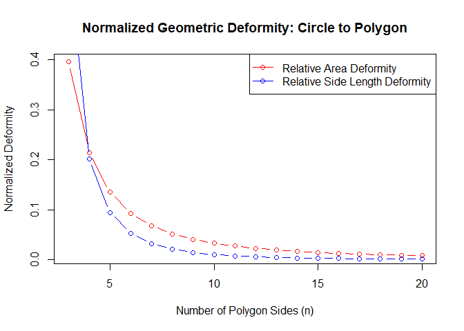
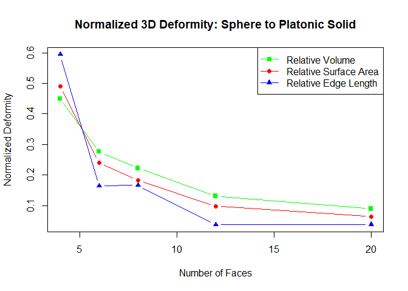

<!-- README.md is generated from README.Rmd. Please edit that file -->

# deformations

<!-- badges: start -->
<!-- badges: end -->

The goal of `deformations` is to provide a set of tools to quantify the
geometric “tension” or “inconsistency” that arises when transforming one
shape into another, a concept formally related to the **isoperimetric
deficit**.

## Installation

You can install the development version of deformations from
[GitHub](https://github.com/) with:

``` r
# install.packages("pak")
pak::pak("mightymetrika/deformations")
```

## Core Concept: Isoperimetric Deficit

The central idea is based on a classic geometric principle formalized by
the **isoperimetric inequality**. For a given perimeter, a circle
encloses the maximum possible area. Consequently, when transforming a
circle into a regular polygon, it is impossible to preserve both the
perimeter and the area simultaneously.

This package computes these discrepancies (which it terms “deformities”)
by comparing shapes derived from competing conservation goals. For
example, it calculates the difference between:

1.  A polygon whose side length is chosen to preserve a circle’s
    **area**.
2.  A polygon whose side length is chosen to preserve a circle’s
    **perimeter**.

The package extends this concept from 2D circles to 2D ellipses and from
3D spheres to the five Platonic solids.

## Features

The package calculates three types of “deformities”:

- **Side/Edge Length Deformity**: The difference in side or edge length
  between a shape derived from preserving area/volume versus one derived
  from preserving perimeter/surface area (`dcaprps`, `deaprps`,
  `dsvsarps`).
- **Area/Surface Area Deformity**: The difference in area or surface
  area between the two resulting shapes (`dcaprpa`, `deaprpa`,
  `dsvsarpa`).
- **Volume Deformity**: The difference in volume between the two
  resulting 3D shapes (`dsvsarpv`).

## Usage

Here is a basic example demonstrating the deformity between a circle and
a regular polygon. As the number of sides (`n`) increases, the polygon
more closely approximates the circle, and both the side length and area
deformities approach zero.

``` r
library(deformations)

# Define a range of polygons from a triangle to a 20-sided polygon
n_vals <- 3:20

# Calculate the deformity in side length and area compared to a unit circle
side_deformity <- dcaprps(n_vals)
area_deformity <- dcaprpa(n_vals)

# Normalize the values to make them dimensionless for a fair comparison
# Normalize area deformity by the circle's area (pi*r^2, with r=1)
# Normalize side deformity by the circle's radius (r=1)
norm_area_def <- area_deformity / pi
norm_side_def <- side_deformity / 1

# Plot the results
plot(n_vals, norm_area_def, type = "b", col = "red",
     xlab = "Number of Polygon Sides (n)", ylab = "Normalized Deformity",
     main = "Normalized Geometric Deformity: Circle to Polygon")
lines(n_vals, norm_side_def, type = "b", col = "blue")
legend("topright", c("Relative Area Deformity", "Relative Side Length Deformity"), 
       col = c("red", "blue"), lty = 1, pch = 1)
```

<div class="figure">


<p class="caption">
Comparison of normalized Area and Side Length Deformity as the number of
polygon sides increases.
</p>

</div>

## The 3D Deformity Trilogy

The package provides a similar set of functions for exploring the
transformation of a sphere into one of the five Platonic solids
(identified by their number of faces: 4, 6, 8, 12, or 20).

``` r
# Define the five Platonic solids
solids <- c(4, 6, 8, 12, 20)

# Calculate the three types of deformity for each
edge_def <- dsvsarps(solids)
area_def <- dsvsarpa(solids)
vol_def <- dsvsarpv(solids)

# Plot the results
plot(solids, vol_def, col="green", pch=15,
     xlab="Number of Faces", ylab="Deformity Value",
     main="3D Deformity: Sphere to Platonic Solid",
     ylim=range(c(edge_def, area_def, vol_def))) # Set y-axis to fit all points
points(solids, area_def, col="red", pch=16)
points(solids, edge_def, col="blue", pch=17)
legend("topright", c("Volume", "Surface Area", "Edge Length"),
       col=c("green","red","blue"), pch=c(15,16,17))
```

<div class="figure">


<p class="caption">
Comparison of deformity types for the five Platonic solids.
</p>

</div>

## License

This package is licensed under the MIT License.
